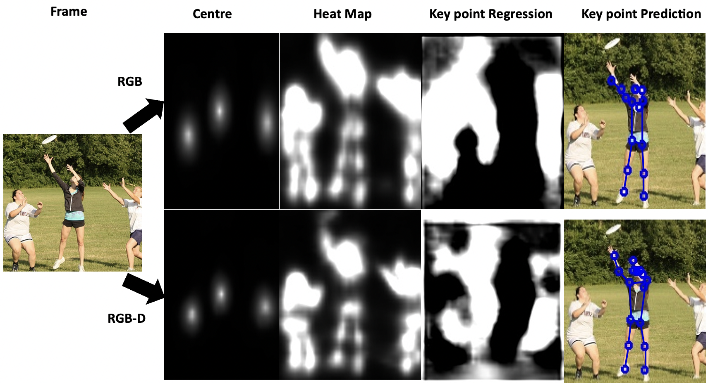

## How To Run
To run an estimate on a dataset that you have provided. Run predict.py to show predict result, or run evaluate.py to compute my accuracy on test dataset. Update `test_img_path` to the path of your images and run.

```bash
python scripts/predict.py
```

## Results
This version of the model that was trained using depth data has proven to be able to outperform the original model by running more accurate keypoint predictions on image frames with more complex movements. We ran a comparison between both models on some frames as shown below.
#### `Some samples: `



