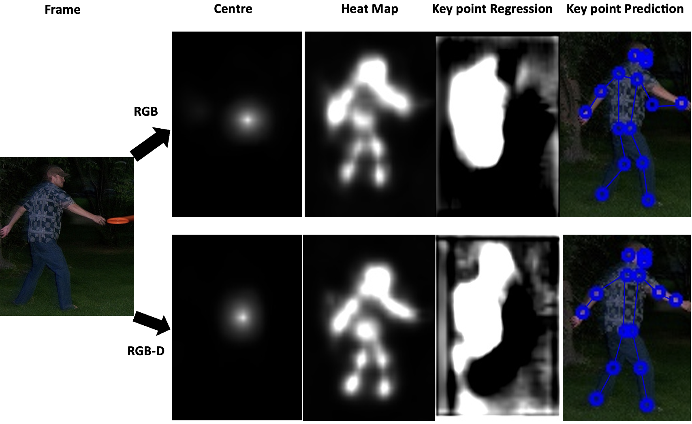
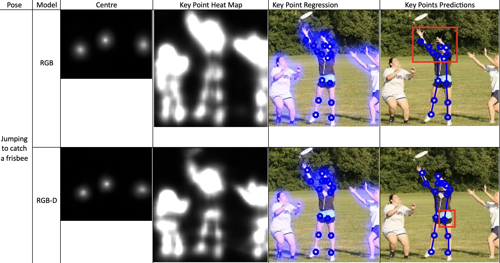

# Movenet.Depth
This is a modification of the pytorch Movenet version "Movenet.Pytorch" created by @fire717 to include depth data of coco images. Depth is extracted using the state-of-the-art monocular depth estimation model "MiDas".


## Intro


MoveNet is an ultra fast and accurate model that detects 17 keypoints of a body.
This is A Pytorch implementation of MoveNet from Google. Include training code and pre-train model.

Google just release pre-train models(tfjs or tflite), which cannot be converted to some CPU inference framework such as NCNN,Tengine,MNN,TNN, and we can not add our own custom data to finetune, so there is this repo.


## How To Run
Run predict.py to show predict result, or run evaluate.py to compute my acc on test dataset.
```
python predict.py
```

## Results
This version of the model that was trained using depth data has proven to be able to outperform the original model by running more accurate keypoint predictions on image frames with more complex movements. We ran a comparison between both models on some frames as shown below.
#### Some samples




## Resource
1. [Blog:Next-Generation Pose Detection with MoveNet and TensorFlow.js](https://blog.tensorflow.org/2021/05/next-generation-pose-detection-with-movenet-and-tensorflowjs.html
)
2. [model card](https://storage.googleapis.com/movenet/MoveNet.SinglePose%20Model%20Card.pdf)
3. [TFHub：movenet/singlepose/lightning
](https://tfhub.dev/google/movenet/singlepose/lightning/4
)
4. [My article shared: 2021轻量级人体姿态估计模型修炼之路（附谷歌MoveNet复现经验）](https://zhuanlan.zhihu.com/p/413313925)
